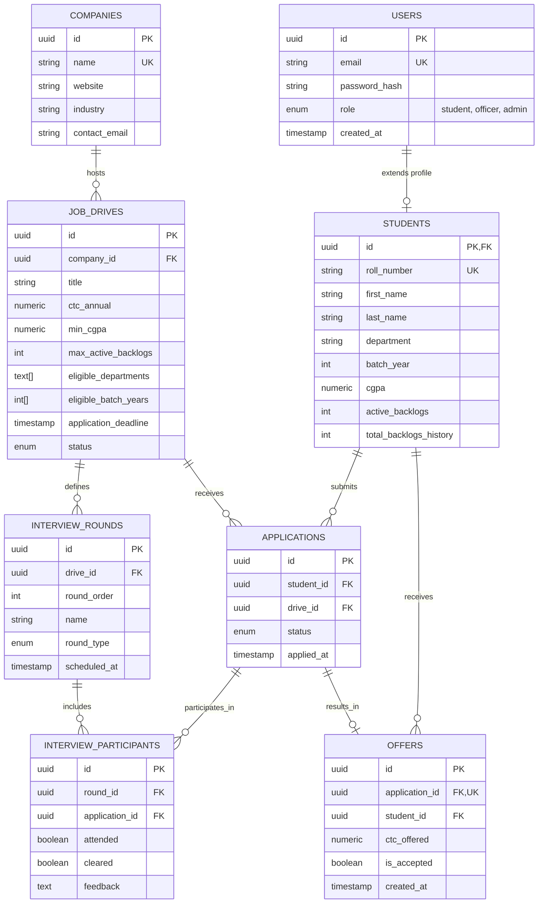

# Entity Relationship Diagram (ER_DIAGRAM.md) [P3]

This diagram visualizes the relational schema of the Unified Campus Placement and Eligibility Intelligence database.

```mermaid
erDiagram
    USERS ||--o| STUDENTS : "extends profile"
    COMPANIES ||--o{ JOB_DRIVES : "hosts"
    JOB_DRIVES ||--o{ APPLICATIONS : "receives"
    STUDENTS ||--o{ APPLICATIONS : "submits"
    JOB_DRIVES ||--o{ INTERVIEW_ROUNDS : "defines"
    INTERVIEW_ROUNDS ||--o{ INTERVIEW_PARTICIPANTS : "includes"
    APPLICATIONS ||--o{ INTERVIEW_PARTICIPANTS : "participates_in"
    APPLICATIONS ||--o| OFFERS : "results_in"
    STUDENTS ||--o{ OFFERS : "receives"

    USERS {
        uuid id PK
        string email UK
        string password_hash
        enum role "student, officer, admin"
        timestamp created_at
    }

    STUDENTS {
        uuid id PK,FK
        string roll_number UK
        string first_name
        string last_name
        string department
        int batch_year
        numeric cgpa
        int active_backlogs
        int total_backlogs_history
    }

    COMPANIES {
        uuid id PK
        string name UK
        string website
        string industry
        string contact_email
    }

    JOB_DRIVES {
        uuid id PK
        uuid company_id FK
        string title
        numeric ctc_annual
        numeric min_cgpa
        int max_active_backlogs
        text[] eligible_departments
        int[] eligible_batch_years
        timestamp application_deadline
        enum status
    }

    APPLICATIONS {
        uuid id PK
        uuid student_id FK
        uuid drive_id FK
        enum status
        timestamp applied_at
    }

    INTERVIEW_ROUNDS {
        uuid id PK
        uuid drive_id FK
        int round_order
        string name
        enum round_type
        timestamp scheduled_at
    }

    INTERVIEW_PARTICIPANTS {
        uuid id PK
        uuid round_id FK
        uuid application_id FK
        boolean attended
        boolean cleared
        text feedback
    }

    OFFERS {
        uuid id PK
        uuid application_id FK,UK
        uuid student_id FK
        numeric ctc_offered
        boolean is_accepted
        timestamp created_at
    }
```
